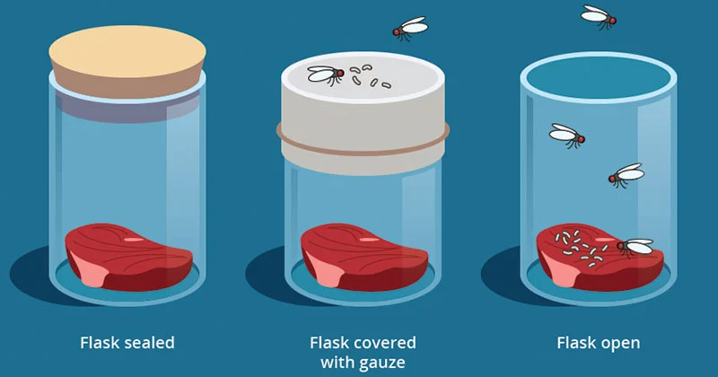

Silvia Rios     
Mrs.Lucero  
AP Biology 
Period 1  
10 October, 2023

<h1 style="text-align: center;">How Did Life Begin?</#>

## Spontaneous Generation

- Belief that animals would randomly spawn in from nothing when food was exposed.
- This theory led to the hypothesis that "Life comes from life" by Louis Pasteur, the father of microbiology.

## What was the Miller-Urey experiment?

- 1st attempt at simulating ancient earth conditions for the purpose of testing ideas about the origin of life.
- Miller Urey demonstrated that biomolecules can form under ancient earth-like conditions and that simple molecules form into biomonomers.

## 4 Steps for life to emerge on earth
1. Abiotic synthesis of amino acids and nucleic acids.
2. Monomers must be able to join together to form more compex polymers using energy that is obtained from the surtrouding environment.
3. Rna/Dna molecules form and gain ability to reproduce and stabilize by using chemical bonds and complimentary bonding.
4. Evoltuion of protobiont membrane of phospholipids and proteins to keep the cell intact.