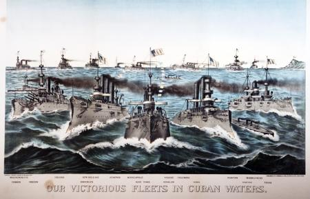

Silvia Rios 
Mr.Yeager 
AP US History 
Period 5 
5 April, 2024

<h1 style="text-align:center;">Period 7 Notes</h1>

---

### The Civil War
- The Civil war started after 11 Southern states serperated themselves from the United States and formed their own government.

| Causes of the Civil War | | Effects of the Civil War| |
| :-------: | :--------:| :------: | :---: |
| economic policies| | Confirmed sigle poltiical entity of the US  |
|Cultural Values | | Freedom for millions of enslaved americans |
|Federal Government | | Stronger US Forgeign power and influence |

### 4 Main People in the Civil War
1. Abraham Lincoln
2. Ulysses S. Grant 
3. Jefferson Davis
4. Stephen Douglas

### TL;DR
[APUSH Period 7 10minute review](https://youtu.be/RBb_TVqMy7c?si=IRRCTzFyrbQe70Sq) 
